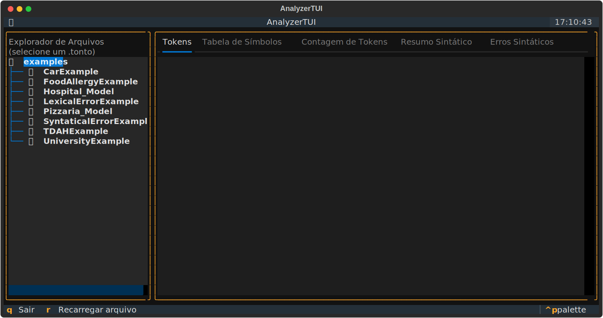
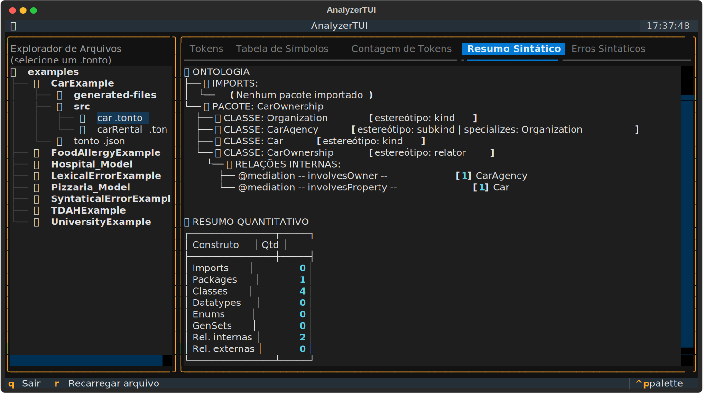

# Analisador Sintático para a Linguagem TONTO

Este projeto implementa um **Analisador Sintático** (Parser) para a linguagem [*TONTO*](https://matheuslenke.github.io/tonto-docs/docs/intro), utilizando **Python** e a biblioteca **PLY (Python Lex-Yacc)**. O objetivo é validar a estrutura sintática de uma ontologia descrita nessa linguagem, produzindo um **resumo sintático** que representa a estrutura do programa.

---

## 📋 Tabela de Conteúdos
<!--ts-->
   * [A Linguagem TONTO](#-a-linguagem-tonto)
   * [Sobre o Projeto](#-sobre-o-projeto)
   * [Tecnologias Utilizadas](#-tecnologias-utilizadas)
   * [Estrutura de Pastas](#-estrutura-de-pastas)
   * [Funcionalidades](#-funcionalidades)
   * [Construtos Reconhecidos](#-construtos-reconhecidos)
   * [Como Usar](#-como-usar)
   * [Exemplo de Uso](#-exemplo-de-uso)
   * [Autores](#%E2%80%8D-autores)
   * [Licença](#-licença)
<!--te-->

---

## 🧩 A Linguagem TONTO

A **TONTO** (*Textual Ontology Language*) é uma linguagem textual para modelagem de ontologias, desenvolvida por **Matheus Lenke Coutinho**. Criada com o objetivo de superar limitações das linguagens de modelagem puramente visuais, ela permite a **edição**, **validação** e **versionamento** de ontologias por meio de **código textual** e também a **conversão** para outros para outros formatos como:

* *OntoUML*
* *gUFO (OWL)*
* *JSON*

Também possui extensão para o *VSCode*, permitindo criar módulos `.tonto`, gerenciar dependências com o *Tonto Package Manager* e gerar modelos interoperáveis com o *Protégé* e o *Visual Paradigm*.

> [!TIP]
> Para mais informações sobre a linguagem, consulte a [documentação oficial](https://matheuslenke.github.io/tonto-docs/docs/intro), a [monografia completa](https://matheuslenke.github.io/tonto-docs/pdf/Tonto.pdf) e o [repositório oficial no GitHub](https://github.com/matheuslenke/Tonto).

---

## 📖 Sobre o Projeto

O **Analisador Sintático para a Linguagem TONTO** foi desenvolvido como parte de um estudo prático sobre a construção de compiladores e ferramentas de análise sintática. O projeto complementa o **Analisador Léxico** (documentação completa pode ser acessada [aqui](https://github.com/geyseevelyn/lexical_analyzer)) previamente desenvolvido e consome diretamente os *tokens* produzidos por ele. O objetivo é verificar a corretude da especificação textual de uma ontologia nos seguintes casos:

* **Declaração de importações**;
* **Declaração de pacotes**;
* **Declaração de classes**;
* **Declaração de tipos de dados**;
* **Declaração de classes enumeradas**;
* **Declaração de generalizações (*generalization sets*)**;
* **Declarações de relações (internas e externas)**.

---

## 🛠 Tecnologias Utilizadas

* **Python 3.10+**
* **PLY** (Python Lex-Yacc)
* **Textual** (*framework* TUI para a interface em terminal)
* **TONTO** (Extensão do *VS Code*, *Tonto CLI* e *Tonto Package Manager*).

---

## 📂 Estrutura de Pastas

```shell
syntactic_analyzer/
├── docs/                      
│   ├── images/                  # Imagens da documentação
│   └── tonto_constructs.md      # Detalhes sobre as construções da linguagem TONTO
│
├── examples/                    # Arquivos TONTO de entrada para testes
├── src/                        
│   ├── cli/
│   │   ├── __init__.py          # Indica que 'cli' é um pacote Python
│   │   └── main.py              # Ponto de entrada da aplicação via CLI (menu interativo em texto)
│   │
│   ├── lexical/
│   │   ├── __init__.py          # Indica que 'lexical' é um pacote Python
│   │   ├── lexer_reports.py     # Funções para exibir relatórios léxicos (Tokens, Tabela de Símbolos, Contagem)
│   │   └── lexer.py             # Definições do Lexer (PLY) e regras léxicas (tokens) 
│   │
│   ├── parsing/
│   │   ├── __init__.py          # Indica que 'parsing' é um pacote Python
│   │   ├── grammar.py           # Definições do Parser (PLY) e regras de gramática
│   │   ├── parse_reports.py     # Funções para exibir relatórios sintáticos (Resumo e Erros)
│   │   └── summary.py           # Classe ModelBuilder para coletar o resumo sintático
│   │
│   ├── ui/
│   │   ├── __init__.py          # Indica que 'ui' é um pacote Python
│   │   └── tui.py               # Interface TUI (Textual) com abas para resultados
│   │
│   └── __init__.py              # Define 'src' como o pacote raiz.
│
├── .gitignore                   # Arquivo para ignorar pastas e arquivos gerados (padrão Git)
├── LICENSE                      # Informações sobre a licença de uso do código.
├── README.md                    # Documentação principal do projeto.
└── requirements.txt             # Pré-requisitos para instalação das dependências do projeto

```

---

## ✨ Funcionalidades

Além de manter todas as funcionalidades do [**analisador léxico**](https://github.com/geyseevelyn/lexical_analyzer), o **Analisador Sintático** oferece:

* **Validação Sintática**: verifica a corretude estrutural de ontologias escritas em **TONTO**;

* **Geração de Resumo Sintático**: exibe uma representação hierárquica da estrutura do programa e a quantidade de construtos válidos encontrados;

* **Detecção de Erros**: identifica e reporta erros sintáticos com detalhes de linha e *token*;

* **Integração com Lexer**: usa os *tokens* gerados pelo analisador léxico;

* **Menu Interativo:** permite a navegação visual por arquivos `.tonto` e a visualização dos resultados das **análises léxica** e **sintática**.

---

## 🔤 Construtos Reconhecidos  

A **especificação detalhada** dos construtos da linguagem **TONTO** reconhecidos pelo **analisador sintático** pode ser encontrada nesse [documento](docs/tonto_constructs.md).

---

## 🚀 Como Usar

### Pré-requisitos

* [Python 3.10+](https://www.python.org/downloads/)
* [PLY (Python Lex-Yacc)](https://www.dabeaz.com/ply/)
* [Textual](https://textual.textualize.io/getting_started/)

### Instalação (recomendada)

1. Clone o repositório:

   ```bash
   git clone https://github.com/geyseevelyn/syntactic_analyzer.git
   cd syntactic_analyzer
   ```

2. Crie e ative um ambiente virtual (**Opcional, mas recomendado**):

   - Windows (*PowerShell*):

     ```powershell
     python -m venv .venv
     .\.venv\Scripts\Activate.ps1
     ```

   - Linux/macOS (*bash*):

     ```bash
     python -m venv .venv
     source .venv/bin/activate
     ```

3. Instale as dependências do projeto:

   ```bash
   pip install -r requirements.txt
   ```

### Execução

Você pode executar o analisador de duas formas: via linha de comando (CLI) ou via interface de terminal (UI/TUI).

#### OPÇÃO A: Via CLI (menu em texto)

1. Execute o módulo principal da CLI:

   ```bash
   python -m src.cli.main
   ```

2. No menu interativo, escolha uma opção:
   - Digitar o caminho completo do arquivo `.tonto` (Opção 1);
   - Listar e escolher um arquivo `.tonto` da pasta `examples` (Opção 2).

3. Após a análise do arquivo, utilize as opções do menu principal para *Tokens*, *Tabela de Símbolos*, *Contagem de Tokens*, ***Resumo Sintático*** e ***Erros Sintáticos***.

#### OPÇÃO B: Via UI/TUI (interface com abas — Textual)

<p align=center>
   
</p>


> [!IMPORTANT]
> Para melhor experiência, execute a TUI no terminal do seu sistema (ex.: *Windows Terminal/PowerShell*, *macOS Terminal* ou *terminal do Linux*). No terminal integrado do *VS Code*, o suporte ao mouse/seleção do *Textual* pode não funcionar corretamente.

1. Já na pasta do projeto, execute a interface *TUI*:

   ```bash
   python -m src.ui.tui
   ```

2. Use o painel à esquerda para navegar nos diretórios e selecione um arquivo `.tonto`.

3. Os resultados aparecerão nas abas: *Tokens*, *Tabela de Símbolos*, *Contagem de Tokens*, ***Resumo Sintático*** e ***Erros Sintáticos***.

---

## 💻 Exemplo de Uso

### Entrada

   ```tonto
   package CarOwnership 

   kind Organization
   subkind CarAgency specializes Organization
   kind Car

   relator CarOwnership {
      @mediation
      -- involvesOwner -- [1] CarAgency

      @mediation
      -- involvesProperty -- [1] Car
   }
   ```

### Saída Esperada

   <details>
   <summary>Clique para expandir</summary>
   <br>
      
   </details>

---

## 👨‍💻 Autores

* [Geyse Evelyn](https://github.com/geyseevelyn)
* [Ivanildo Junior](https://github.com/jrsilva95)

---

## 📜 Licença
Este projeto está sob a licença *MIT*. Consulte o arquivo [LICENSE](./LICENSE) para mais detalhes.

---

<div align="center">
    <a href="https://github.com/geyseevelyn/syntactic_analyzer/tree/geyse?tab=readme-ov-file#analisador-sint%C3%A1tico-para-a-linguagem-tonto">Voltar ao topo</a>
</div>
